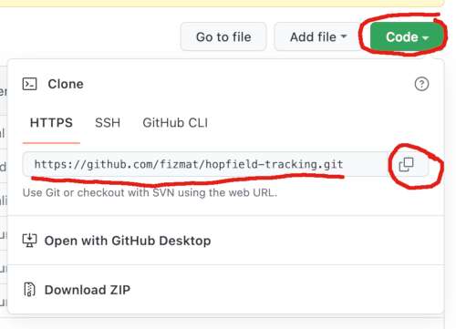

# Normal Windows setup for new people

## Make sure Git is installed, clone this repo

1. Is git bash available in the start menu? Does the `git` command work in any shell?
2. If not, install git for windows (both links point to the same setup):
    - https://gitforwindows.org/
    - https://git-scm.com/download/win
    - Setup asks many questions, default answers are usually OK.
3. `git clone {this repository's url}` in any shell (cmd, Powershell, git bash)
    - 

## 1. Without conda: python + venv

### Install python
Any 3.7+ should work, but it's easiest to use the latest version
- https://www.python.org/downloads

### Create virtual environment
1. Find the full path to your python 3.8 executable
    - for example `C:\Users\{username}\AppData\Local\Programs\Python310\python.exe` or `C:\Python310\python.exe`
2. Create and activate virtual python environment
    - in CMD:
        - `cd {local project repo directory}`
        - `{python.exe full path} -m venv venv`
        - `venv\Scripts\activate.bat`
        - `pip install -r requirements.txt`
    - in git bash:
        - `cd {local project repo directory}`
        - `{python.exe path} -m venv venv`
        - `. venv/Scripts/activate`
        - `pip install -r requirements.txt`
3. `pytest` to check what works

## 2. With conda

### Install miniconda
- Visit https://docs.conda.io/en/latest/miniconda.html
- Download and install the latest miniconda for Windows
- Start menu -> Anaconda Powershell Prompt
    - Update base conda environment `conda update --all`
    - (Optional) Install experimental mamba solver (it's faster and uses less memory) `conda install conda-libmamba-solver`

### Create conda environment
In Anaconda Powershell Prompt
- `cd {local project repo directory}`
- `conda env create --experimental-solver=libmamba` if you installed libmamba
- `conda env create` if you didn't install libmamba
- activate the new environment `conda activate hopfield-tracking`
- `pytest` to check what works

## Use whatever IDE or editor you like
- PyCharm
- Visual Studio Code
- Notepad++
